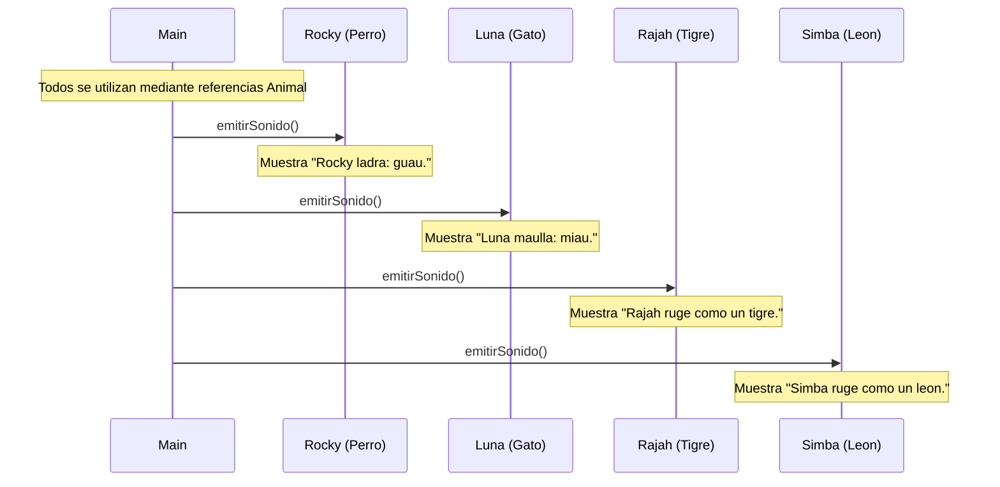

# Interacción polimórfica

Nombre: Alejandro Daniel Elia Alarcón
Sección: 012V

## Escenario
Main recorre varios animales mediante referencias de tipo Animal.
Para cada uno llama a emitirSonido(). Java ejecuta la versión
correspondiente al objeto real.

## Diagrama de interacción

## Qué demuestra
- La llamada es siempre emitirSonido(), sin parámetros.
- El tipo de referencia es Animal; los objetos reales son
  Perro, Gato, Tigre y Leon.
- Cada especie ejecuta su propia versión del método.
- Main no necesita preguntar qué especie es para elegir el sonido.
- Este comportamiento es polimorfismo.
- La selección del método durante la ejecución es despacho dinámico.

## Relación con el código
Animal declara emitirSonido() y las cuatro especies lo sobrescriben
con @Override. Mascota y Salvaje conectan las especies con Animal
mediante la herencia.

El método devuelve void: los textos del diagrama representan
mensajes mostrados en consola, no valores retornados.

## Alcance
Este diagrama describe la interacción prevista.
La ejecución desde Main se implementará en la actividad correspondiente.