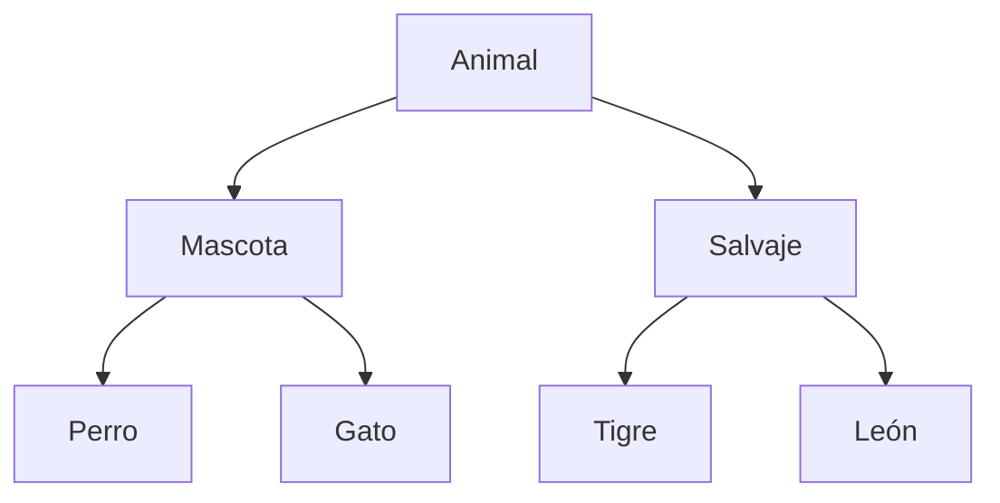

# Jerarquía conceptual de animales

Nombre: Alejandro Daniel Elia Alarcón
Sección: 012V

## Diagrama

## Justificación
- Animal es el concepto general: todos comparten datos como nombre,
  edad y peso, y acciones como alimentarse y emitir sonidos.
- Mascota es una especialización de Animal que agrupa a Perro y Gato.
  En nuestra propuesta, comparten información sobre su responsable.
- Salvaje es una especialización de Animal que agrupa a Tigre y León.
  En nuestra propuesta, comparten información sobre su procedencia.
- Las especies concretas permiten distinguir características
  y comportamientos particulares, como ladrar, maullar o rugir.

## Relaciones
- Todo perro es una mascota y también un animal.
- Todo gato es una mascota y también un animal.
- Todo tigre es un animal salvaje.
- Todo león es un animal salvaje.

## Alcance
La clasificación corresponde al contexto del enunciado.
Los datos mencionados son propuestas que deben validarse.
Esta jerarquía organiza conceptos; todavía no define código Java.
